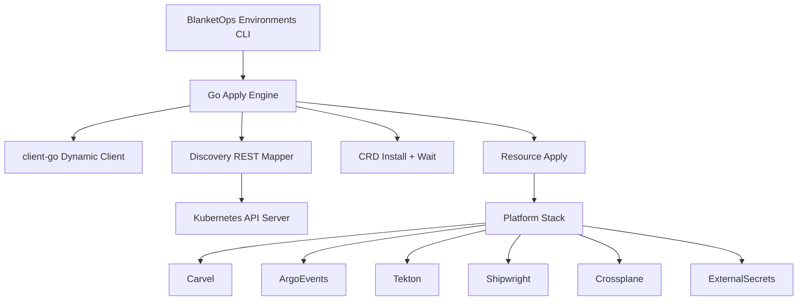
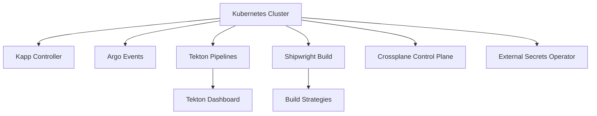
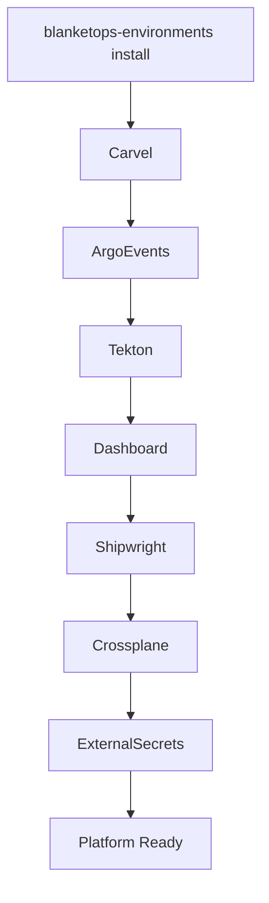
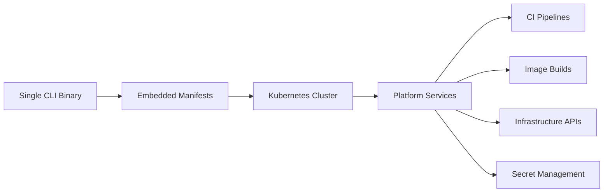

# 🚀 BlanketOps Environments — Platform Bootstrap CLI

BlanketOps Environments CLI is a self-contained Kubernetes platform bootstrapper.

A single binary installs a complete cloud-native delivery stack directly into a cluster using the Kubernetes API — **no kubectl required**.

The binary embeds all manifests and bootstrap scripts, making it suitable for minimal systems, appliances, and automated cluster provisioning.

---

## ✨ What It Installs

The installer deploys a full platform stack:

| Component                     | Role                               |
| ----------------------------- | ---------------------------------- |
| **Carvel Kapp Controller**    | Packaging and lifecycle management |
| **Argo Events**               | Event-driven pipelines             |
| **Tekton Pipelines**          | CI/CD execution engine             |
| **Tekton Dashboard**          | Pipeline UI                        |
| **Shipwright Build**          | Kubernetes-native image builds     |
| **Crossplane**                | Infrastructure orchestration       |
| **External Secrets Operator** | Secure secret integration          |

Together these components form a self-hosted software delivery platform.

---

## ⚙️ Design Goals

The CLI is built for environments where traditional tooling may not exist.

Ideal for:

- Air-gapped clusters
- Bare metal Kubernetes nodes
- Immutable appliances
- Edge deployments
- Gokrazy systems
- Ephemeral CI clusters

---

## 🔧 Pure Go Kubernetes Apply Engine

All resources are applied using the Kubernetes API directly. No external tools are required.

The installer uses:

- `client-go` dynamic client
- Discovery-backed REST mapper
- Unstructured object decoding

The apply engine performs installation in deterministic order:

```
CRD detection
    ↓
CRD installation
    ↓
CRD registration wait
    ↓
remaining resource application
```

This guarantees deterministic installation order.

---

## 📦 Fully Embedded Assets

All manifests and scripts are compiled into the binary using `go:embed`. Nothing is read from disk.

Embedded resources include:

```
dependencies/
├── carvel/
├── argoevents/
├── tekton/
└── shipwright/

scripts/
├── install-crossplane.sh
├── install-externalsecrets.sh
└── setup-shipwright-cert.sh
```

This ensures the binary works anywhere without filesystem dependencies.

---

## 🔐 Shipwright Webhook Certificate Automation

The installer automatically configures Shipwright's webhook certificates. It performs:

1. CSR generation
2. Certificate approval
3. TLS secret creation
4. CA bundle injection
5. Webhook restart
6. Deployment readiness checks

No manual certificate management is required.

---

## 🧊 Static Builds (Gokrazy Compatible)

A fully static binary can be produced for minimal environments:

```bash
make static
```

The resulting binary can run on:

- gokrazy systems
- Minimal containers
- Stripped-down Linux environments

---

## 🛠️ Build & Install

Build the CLI:

```bash
make build
```

Install to `$HOME/.local/bin` (fallback `$HOME/bin`):

```bash
make install
```

Build a static binary:

```bash
make static
```

---

## 🚀 Usage

Install the platform stack:

```bash
blanketops-environments install
```

Uninstall everything:

```bash
blanketops-environments uninstall
```

Install only dependencies:

```bash
blanketops-environments dependencies install
```

Cluster management commands:

```bash
blanketops-environments cluster up [name]
blanketops-environments cluster down [name]
blanketops-environments cluster status [name]
```

---

## 📂 Project Structure

```
blanketops-environments-cli
│
├── main.go
├── cmd/
│   ├── install.go
│   ├── uninstall.go
│   └── cluster.go
│
├── core/
│   ├── apply.go
│   ├── kube.go
│   ├── dependencies.go
│   └── wait.go
│
├── dependencies/
│   ├── carvel/
│   ├── argoevents/
│   ├── tekton/
│   └── shipwright/
│
├── scripts/
│   ├── install-crossplane.sh
│   ├── install-externalsecrets.sh
│   └── setup-shipwright-cert.sh
│
├── util/
│   ├── exec.go
│   ├── fs.go
│   └── os.go
│
├── magefile.go
└── Makefile
```

---

## 🧪 Local Testing

Create a test cluster:

```bash
kind create cluster
```

Install the stack:

```bash
blanketops-environments install
```

Verify components:

```bash
kubectl get pods -A
```

---

## ⚙️ Gokrazy Workflow

Build the static binary:

```bash
make static
```

Add to a gokrazy package:

```bash
gok add ./bin/blanketops-environments-static
```

Build the image:

```bash
gok build
```

---

## 🧠 Platform Architecture

How the CLI interacts with Kubernetes:



---

## 🧱 Platform Stack

What the installer builds inside the cluster:



---

## ⚙️ Installation Flow

What the CLI does, step by step:



---

## 🌐 Bootstrap Model

The core architectural idea: a single binary, fully self-contained.



```bash
blanketops-environments install
```

---

## 🤝 Contributing

Pull requests and improvements are welcome.

The project is evolving toward a fully self-hosted platform bootstrap system for Kubernetes environments.
