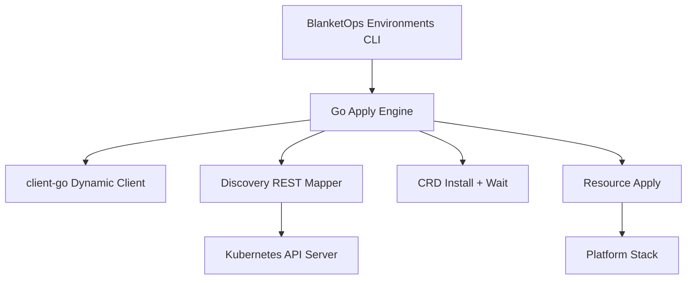
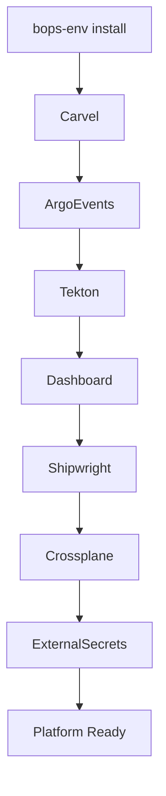

# 🚀 BlanketOps Environments — Platform Bootstrap CLI

BlanketOps Environments CLI is a self-contained Kubernetes platform bootstrapper.

A single binary installs a complete cloud-native delivery stack directly into a cluster using the Kubernetes API — **no kubectl required**.

The binary embeds all manifests and bootstrap scripts, making it ideal for minimal systems, immutable appliances, and automated cluster provisioning.

---

## 🔐 Provenance, Signing & Security

We take supply chain security seriously. Every release is signed and attested to ensure artifact integrity from build to deployment.

- **Signed:** Binaries are signed using `cosign` (keyless mode).
- **Attested:** Every build generates a formal SLSA-compliant provenance attestation.

**Verification:**

```bash
# Verify the signature
cosign verify-blob --certificate-identity-regexp ".*" --signature bin/bops-env-static.sig bin/bops-env-static

# Verify the attestation via GitHub CLI
gh attest verify bin/bops-env-static --owner <your-org-or-username>
```

---

## ✨ What It Installs

The installer deploys a full platform stack:

| Component                     | Role                               |
| ----------------------------- | ----------------------------------- |
| **Carvel Kapp Controller**    | Packaging and lifecycle management |
| **Argo Events**               | Event-driven pipelines             |
| **Tekton Pipelines**          | CI/CD execution engine             |
| **Tekton Dashboard**          | Pipeline UI                        |
| **Shipwright Build**          | Kubernetes-native image builds     |
| **Crossplane**                | Infrastructure orchestration       |
| **External Secrets Operator** | Secure secret integration          |

---

## ⚙️ Design Goals

Built for environments where traditional tooling is unavailable:

- Air-gapped clusters
- Bare metal / Edge nodes
- Immutable appliances / Gokrazy
- Ephemeral CI environments

---

## 🧠 Platform Architecture

The `client-go` dynamic engine ensures deterministic installation order:



---

## 📦 Fully Embedded Assets

All manifests and scripts are compiled into the binary via `go:embed`. Zero filesystem dependencies at runtime.

```
dependencies/     # Embedded YAML manifests
scripts/          # Shell-based configuration logic
```

---

## 🚀 Usage

```bash
# Install the entire platform stack
bops-env install

# Uninstall everything
bops-env uninstall

# Install only dependencies
bops-env dependencies install

# Cluster management
bops-env cluster up [name]
bops-env cluster down [name]
bops-env cluster status [name]
```

---

## 🧊 Gokrazy & Static Builds

For ultra-minimal systems, build a fully static binary:

```bash
mage static

# Add to gokrazy
gok add ./bin/bops-env-static
gok build
```

---

## 🧪 Local Testing

```bash
# Create a test cluster
kind create cluster

# Install the stack
bops-env install

# Verify components
kubectl get pods -A
```

---

## 🧱 Platform Stack Flow



---

## 🤝 Contributing

The project is evolving toward a fully self-hosted platform bootstrap system for Kubernetes environments. Pull requests and improvements are welcome!

Built with ❤️ for the Kubernetes community.
