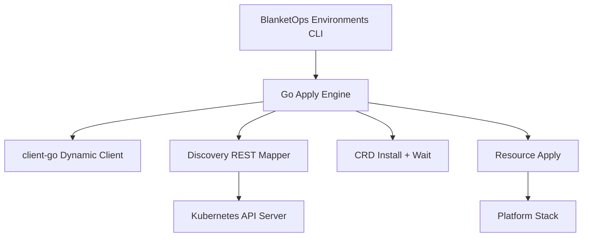
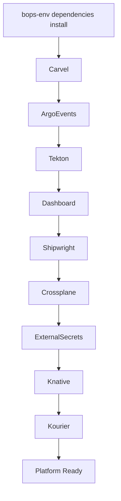

# 🚀 BlanketOps Environments — Platform Bootstrap CLI

BlanketOps Environments CLI is a self-contained Kubernetes platform bootstrapper.

A single binary installs a complete cloud-native delivery stack directly into a cluster using the Kubernetes API — **no kubectl required**.

The binary embeds all manifests and bootstrap scripts, making it ideal for minimal systems, immutable appliances, and automated cluster provisioning.

---

## 📥 Installation

### Linux

Grab the latest signed release from the [Releases page](https://github.com/blanketops/environments-cli/releases/latest):

```bash
# Linux amd64
curl -LO https://github.com/blanketops/environments-cli/releases/latest/download/bops-env-static
chmod +x bops-env-static
sudo mv bops-env-static /usr/local/bin/bops-env

# Linux arm64
curl -LO https://github.com/blanketops/environments-cli/releases/latest/download/bops-env-static-arm64
chmod +x bops-env-static-arm64
sudo mv bops-env-static-arm64 /usr/local/bin/bops-env
```

See [Provenance, Signing & Security](#-provenance-signing--security) below to verify the download before running it. `bops-env self install`/`self uninstall` work here too, since these are the binaries they fetch.

### Windows

No prebuilt binary is published yet — build from source (see [Build from source](#build-from-source) below). Requires Go and [mage](https://magefile.org) on your PATH; `mage install` places `bops-env.exe` under `%USERPROFILE%\.local\bin`.

`bops-env self install`/`self uninstall` aren't supported on Windows (no binary to fetch) — rebuild and re-run `mage install` instead to upgrade.

A handful of `bops-env dependencies install <name>` targets (`crossplane`, `externalsecrets`, `shipwright`, `kourier`) run setup scripts via `bash`, which isn't present on stock Windows — those specific commands need [WSL](https://learn.microsoft.com/windows/wsl/) or Git Bash on your `PATH`. Everything else (including `bops-env dependencies install` for the other components, `status`, `list`, `cluster`, `install`/`uninstall` of the operator) is plain Go and has no such dependency.

### macOS

No prebuilt binary is published yet either, but no extra setup is needed — macOS ships `bash` and the rest of the BSD userland already, so [Build from source](#build-from-source) below works as-is.

### Build from source

```bash
git clone https://github.com/blanketops/environments-cli.git
cd environments-cli
mage install   # builds and installs to ~/.local/bin (falls back to ~/bin if noexec; %USERPROFILE%\.local\bin on Windows)
```

This is the Windows and macOS install path today, and works the same way on Linux as an alternative to the prebuilt binary above.

Run `bops-env version` any time to check which build is currently installed.

---

## 🔐 Provenance, Signing & Security

We take supply chain security seriously. Every release is signed and attested to ensure artifact integrity from build to deployment.

- **Signed:** Binaries are signed using `cosign` (keyless mode).
- **Attested:** Every build generates a formal SLSA-compliant provenance attestation.

**Verification:**

Run these against the file as downloaded, before you `chmod`/`mv` it (substitute `bops-env-static-arm64` for the arm64 asset, or `bin/bops-env-static` if you built locally with `mage static`):

```bash
# Verify the signature (fetch the matching .sig asset first)
curl -LO https://github.com/blanketops/environments-cli/releases/latest/download/bops-env-static.sig
cosign verify-blob --certificate-identity-regexp ".*" --signature bops-env-static.sig bops-env-static

# Verify the attestation via GitHub CLI
gh attest verify bops-env-static --owner blanketops
```

---

## 🧩 The Operator

`bops-env install` installs the BlanketOps Environments operator — the CRDs, RBAC, and controller-manager Deployment that reconcile the platform's custom resources.

That bundle isn't built here: it's published by [blanketops/environments-install](https://github.com/blanketops/environments-install), an install-only repo that owns CRDs, RBAC, and manager manifests as kustomize overlays. Its `make build-installer` target renders `config/default` into a single `dist/install.yaml`, published as the `install.yaml` asset on every tagged release. `bops-env install`/`uninstall` apply/delete that same asset from `https://github.com/blanketops/environments-install/releases/latest/download/install.yaml`.

---

## ✨ What It Installs

The installer deploys a full platform stack:

| Component                           | Role                               |
| ----------------------------------- | ---------------------------------- |
| **Carvel Kapp Controller**    | Packaging and lifecycle management |
| **Argo Events**               | Event-driven pipelines             |
| **Tekton Pipelines**          | CI/CD execution engine             |
| **Tekton Dashboard**          | Pipeline UI                        |
| **Shipwright Build**          | Kubernetes-native image builds     |
| **Crossplane**                | Infrastructure orchestration       |
| **External Secrets Operator** | Secure secret integration          |
| **Knative Serving**           | Serverless workload runtime        |
| **Kourier**                   | Knative's ingress/networking layer |

---

## ⚙️ Design Goals

Built for environments where traditional tooling is unavailable:

- Air-gapped clusters
- Bare metal / Edge nodes
- Immutable appliances / Gokrazy
- Ephemeral CI environments

---

## 🧠 Platform Architecture

The `client-go` dynamic engine ensures deterministic installation order:



---

## 📦 Fully Embedded Assets

All manifests and scripts are compiled into the binary via `go:embed`. Zero filesystem dependencies at runtime.

```
dependencies/     # Embedded YAML manifests
scripts/          # Shell-based configuration logic
```

---

## 🚀 Usage

```bash
# Print the installed CLI's build version
bops-env version

# Install the BlanketOps Environments operator
bops-env install

# Uninstall the operator
bops-env uninstall

# Update the bops-env CLI binary itself
bops-env self install
bops-env self uninstall

# Install the platform stack (dependency manifests)
bops-env dependencies install

# Manage a single dependency instead of the whole stack
bops-env dependencies list
bops-env dependencies install <name>
bops-env dependencies status [name]
bops-env dependencies uninstall <name>

# Cluster management
bops-env cluster up [name]
bops-env cluster down [name]
bops-env cluster status [name]
```

---

## 🧊 Gokrazy & Static Builds

For ultra-minimal systems, build a fully static binary:

```bash
mage static

# Add to gokrazy
gok add ./bin/bops-env-static
gok build
```

---

## 🧪 Local Testing

```bash
# Create a test cluster
kind create cluster

# Install the operator, then the platform stack
bops-env install
bops-env dependencies install

# Verify components
kubectl get pods -A
```

---

## 🧱 Platform Stack Flow



---

## 🤝 Contributing

The project is evolving toward a fully self-hosted platform bootstrap system for Kubernetes environments. Pull requests and improvements are welcome!

Built with ❤️ for the Kubernetes community.
